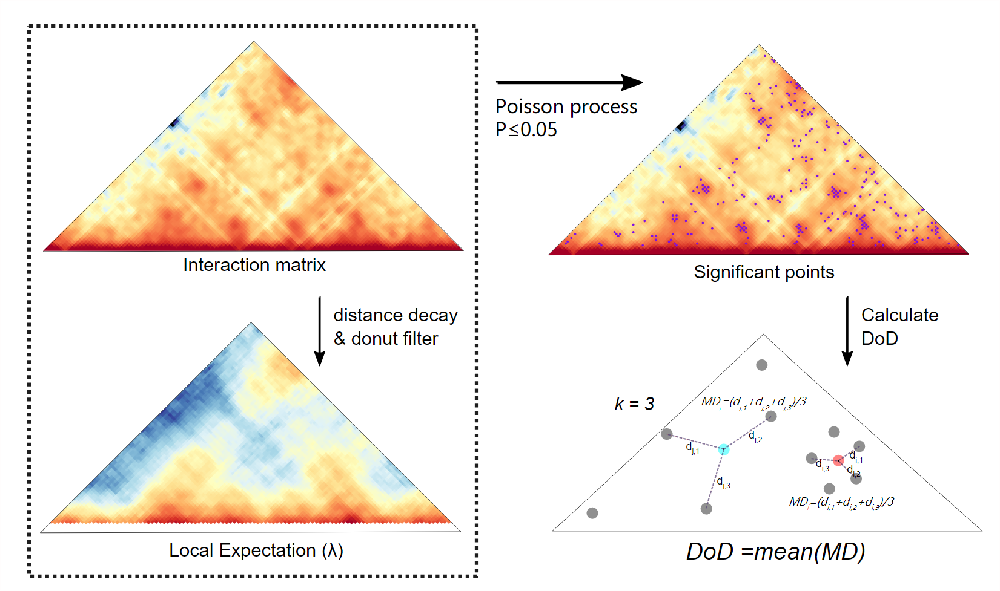

# MDkNN

Chromatin DoD(Degree of Disorder) measurements using
MDkNN(Mean Distance to k-Nearest Neighbors)
method.

This method is similar to XiaoTaoWang's
Aggregate Preference method[[1]](#1), but allow
differential analysis(statistical comprasion)
between two samples.



## Installing dependencies

We recommand use [conda](https://docs.conda.io/en/latest/miniconda.html)
to manage the environment and installing dependencies:

```bash
$ conda create -n mdknn python=3.6
$ conda activate mdknn
(mdknn)$ conda install numpy scipy matplotlib pandas scikit-learn statsmodels tqdm
(mdknn)$ conda install -c bioconda cooler
```

## Usage

### Calculate DoD value of single sample

The input files is a tab splited
TAD(or any chromosome region) list like this:

```
chr1	520000	1280000
chr1	2120000	2320000
chr1	2320000	2600000
chr1	2600000	2640000
chr1	2680000	3360000
chr1	3360000	3800000
...
```

And the corrsponding Hi-C matrix stored in [.cool](https://github.com/mirnylab/cooler) format.

To calculate their DoD using the following command:

```bash
(mdknn)$ python mdknn.py -p sample.cool -t tads.txt -O output.txt -k 3 --ww 7 --pw 4
```

The `sample.cool` and `tads.txt` is your input Hi-C matrix and TAD list.
`-O` specified the output path. `-k` is a parameter represent the number
of significant interaction's neighbors used for calculate the DoD.
In most cases, 3 is a appropriate value.
`-ww` and `-pw` is parameters for interaction selection and noise filtering.
They are sensitive to the matrix resolution, recommand set pw to 4 and ww to 7 at 5 kb,
and (2, 5) at 10 kb.

### Statistical comparison of two samples

The input is almost same to the single sample version, but need
one more Hi-C matrix of second sample.
Note that matrices of two samples to be compared
are best build with same amount of contact pairs.

```bash
(mdknn)$ python mdknn.py -p sample1.cool -p2 sample2.cool -t tads.txt -O output.txt -k 3 --ww 7 --pw 4
```

### Parameters

```
(mdknn)$ python mdknn.py --help
usage: mdknn.py [options]

MDKNN -- Mean Distance of k Nearest Neighbors

optional arguments:
  -h, --help            show this help message and exit
  -O OUTPUT, --output OUTPUT
                        Output file name. (default: None)

Relate to the input:
  -p PATH, --path PATH  Path to the cool URI (default: .)
  -p2 PATH_2, --path-2 PATH_2
                        Path to the cool URI (default: None)
  -t TAD_FILE, --tad-file TAD_FILE
                        Path to the TAD file. (default: None)
  --out-long-range OUT_LONG_RANGE
                        Output the position of long-range points. (default:
                        None)

Feature calculation:
  -k K                  Number of nearest neighbors. (default: 3)
  --pw PW               Width of the interaction region surrounding the peak.
                        According to experience, we set it to 1 at 20 kb, 2 at
                        10 kb, and 4 at 5 kb. (default: 2)
  --ww WW               Width of the donut region Set it to 3 at 20 kb, 5 at
                        10 kb, and 7 at 5 kb. (default: 5)
  --top TOP             Parameter for noisy interaction filtering. By default,
                        30 percent noisy interactions will be eliminated.
                        (default: 0.7)
  --ratio RATIO         Specifies the sample ratio of significant interactions
                        for TAD. (default: 0.05)
  --gap GAP             Maximum gap ratio. (default: 0.2)
```

## References

<a id="1">[1]</a> Wang, Xiao-Tao, et al. "Structural heterogeneity and functional diversity of topologically associating domains in mammalian genomes." Nucleic acids research 43.15 (2015): 7237-7246.

## Thanks

Thanks XiaoTaoWang
for the implementation is based on his
[TADLib](https://github.com/XiaoTaoWang/TADLib).
